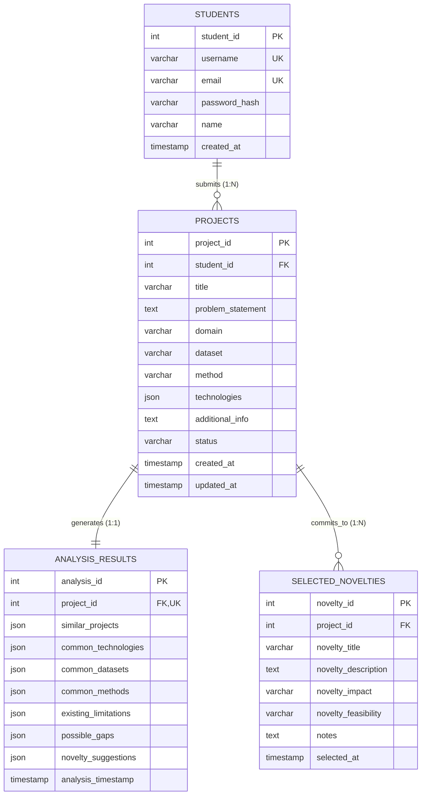

# PROJECT NOVELTY ADVISOR & MANAGEMENT SYSTEM
## Database Management Systems (DBMS) Course Project — Review 1 Report

---

### **Project Metadata & Team Details**

* **Project Title:** Project Novelty Advisor & Management System
* **Course:** Database Management Systems (DBMS)
* **Faculty Guide / Reviewer:** Dr. Katari Balakrishna

#### **Team Members:**
| S.No | Student Name | Registration Number | Primary Responsibility |
|:---:|:---|:---:|:---|
| 1 | **Aarya Jadhav** | **25BCE2975** | Database Design, Backend Architecture & Engine Integration |
| 2 | **Diya S** | **25BAI0235** | Novelty Analysis Logic, Component & Gap Analytics |
| 3 | **Hamsapriya V** | **25BCE2754** | Frontend Interface, Data Visualization & User Workflow |

---

## 1. Executive Summary / Abstract

In academic institutions and universities, thousands of undergraduate and postgraduate students submit capstone, mini-project, and semester course project proposals annually. A persistent issue encountered by academic committees and faculty guides is the redundancy and lack of novelty in submitted topics. Students frequently replicate past projects with cosmetic changes—such as applying standard machine learning algorithms (e.g., Logistic Regression, Random Forest, basic CNNs/BERT) to popular, saturated benchmark datasets (e.g., Kaggle Titanic, Iris, Credit Card Fraud, basic Twitter Sentiment Analysis)—without making meaningful technical or methodological contributions.

Existing institutional systems (e.g., Learning Management Systems like Moodle or Canvas, and plagiarism detectors like Turnitin) suffer from critical limitations: LMS platforms act merely as passive file storage repositories lacking semantic project indexing, while plagiarism engines focus strictly on verbatim textual overlap rather than methodological, algorithmic, or domain-level redundancy. Furthermore, existing tools are punitive (detecting plagiarism to reject submissions) rather than advisory (guiding students on how to enhance novelty).

The **Project Novelty Advisor & Management System** is an end-to-end, database-driven decision-support and project lifecycle management system. Built upon a relational MySQL foundation with native JSON extension capabilities, it enforces strict normalization (BCNF/3NF), transactional ACID consistency, and referential integrity for student and project records. Coupled with a multi-metric similarity and component saturation engine, the system evaluates incoming project proposals against historical repository records across five dimensions (domain, methodology, dataset, tech stack, and keywords). Crucially, the system does not simply output a similarity score; it diagnoses saturated methods, extracts research limitations, identifies technical gaps, and algorithmically generates five structured novelty recommendations. This report outlines the preliminary design, comprehensive literature survey, challenges, database schemas, normalization proofs, novelty justifications, and Review 1 implementation deliverables.

---

## 2. Problem Statement & Motivation

### 2.1 The Problem It Solves
1. **Academic Project Duplication:** Academic departments face severe topic saturation. Hundreds of student teams repeatedly submit projects with identical architectures, leading to stagnation in research output and redundant evaluation efforts.
2. **Cognitive Overload on Faculty Reviewers:** Faculty guides and project coordinators must manually review and cross-check proposals against previous years' archives—an error-prone, time-consuming process that lacks standardized objective metrics.
3. **Absence of Actionable Guidance for Students:** When a student's proposal is rejected for being "unoriginal," students are rarely provided with structured guidance on how to pivot their proposal into an innovative, viable research project.
4. **Disorganized Project Data Management:** Projects are conventionally archived in disparate spreadsheets or flat PDF files, preventing structured querying, longitudinal analytics, tech stack trend monitoring, and historical audits.

### 2.2 Core Objectives
* **Structured DBMS Pipeline:** Design and implement a robust, normalized relational database capable of maintaining student profiles, structured project proposals, multi-faceted similarity analytical outputs, and selected novelty trajectories.
* **Objective Similarity Quantification:** Implement a deterministic, multi-metric similarity framework that benchmarks incoming proposals against archived works.
* **Constructive Advisory Mechanism:** Formulate an intelligent gap-analysis algorithm that identifies overused components and recommends feasible, high-impact novelty pivots.
* **Lifecycle State Tracking:** Provide automated status progression tracking (`submitted`, `analyzed`, `approved`, `revision_needed`).

---

## 3. Literature Survey

A comparative analysis of existing research literature, institutional tools, and commercial systems reveals distinct research and operational gaps.

### 3.1 Comparative Summary Matrix

| Author / System | Approach / Core Technique | Focus Domain | Key Strengths | Critical Limitations / Gaps |
|:---|:---|:---|:---|:---|
| **Salton & McGill (1983) / Vector Space Models** | Term Frequency-Inverse Document Frequency (TF-IDF) & Cosine Distance | Information Retrieval | Fast computation; robust baseline for text matching | Ignores structured relational attributes (datasets, methods, tech stack); purely lexical |
| **Blei, Ng & Jordan (2003) / Topic Modeling** | Latent Dirichlet Allocation (LDA) probabilistic topic modeling | Document Classification | Uncovers hidden thematic clusters across large text corpora | High computational overhead; probabilistic outputs lack deterministic explainability for grading |
| **Turnitin / Urkund / CopyCatch** | N-gram fingerprinting and string matching | Academic Plagiarism Detection | Exceptional at flagging verbatim or paraphrased textual duplication | Punitive rather than constructive; cannot assess whether two distinct text descriptions describe the exact same underlying software architecture |
| **Traditional LMS (Moodle, Blackboard, Canvas)** | Relational CRUD database with static blob/file storage | Course Administration & Assignment Hand-in | Reliable submission workflows and gradebook integration | Zero analytical capability regarding proposal novelty; treats submissions as unindexed file attachments |
| **Enterprise PM Tools (Jira, GitHub Projects, Trello)** | Kanban/Scrum agile task tracking | Software Project Management | Excellent workflow lifecycle tracking and sprint management | No domain-specific intelligence for academic novelty or research gap evaluation |
| **Proposed System: Project Novelty Advisor** | Normalized Relational Schema (MySQL) + Multi-Metric Jaccard & Token Overlap Engine | Academic Project Advisory & Lifecycle Management | Relational integrity (BCNF), explainable multi-attribute scoring, overused component detection, and automated actionable novelty suggestions | Currently rule-based rather than deep contextual embedding-based (planned for future phases) |

### 3.2 Detailed Review of Literature

1. **Information Retrieval & Set-Theoretic Similarity:**
   * *Salton, G., & McGill, M. J. (1983). Introduction to Modern Information Retrieval.*
   * *Takeaway:* Traditional bag-of-words and vector space representations fail when comparing domain-specific technical stacks. The proposed system addresses this by decoupling technologies into set-based Jaccard similarity metrics:
     $$J(A, B) = \frac{|A \cap B|}{|A \cup B|}$$
     This provides invariant, order-independent similarity scoring for programming languages and frameworks.

2. **Plagiarism Detection vs. Conceptual Redundancy:**
   * *Lancaster, T., & Culwin, F. (2005). Investigations into Plagiarism Detection Systems.*
   * *Takeaway:* Plagiarism detection engines fail to catch conceptual duplication where students use different wording to describe an identical system (e.g., "Predicting housing prices with XGBoost on Boston Housing Dataset" vs. "Real estate valuation using gradient boosting trees"). Our system overcomes this by extracting discrete dimensions: Domain, Method, Dataset, and Technology Stack.

3. **Database Architecture for Semi-Structured Analytical Data:**
   * *Elmasri, R., & Navathe, S. B. (2015). Fundamentals of Database Systems (7th ed.).*
   * *Takeaway:* While traditional transactional data (students, projects, logins) demands strict third normal form (3NF) and Boyce-Codd Normal Form (BCNF) to eliminate update and deletion anomalies, analytical results (similarity rankings, dynamic suggestions) possess variable dimensions. Utilizing MySQL 5.7+ native `JSON` columns alongside indexed relational keys establishes an optimal balance between relational consistency and schemaless flexibility.

---

## 4. What is Novel in This Project?

Unlike standard course management software or basic plagiarism checkers, the **Project Novelty Advisor & Management System** introduces distinct novel contributions:

1. **Constructive Advisory Model (Advisory vs. Punitive):**
   * Traditional tools operate punitively: *“Your similarity is 45%, proposal rejected.”*
   * Our system operates constructively: *“Your proposal shares 75% similarity with past projects due to the overused combination of [Twitter Dataset + BERT for Sentiment Analysis]. Here are 5 concrete ways to introduce novelty: (1) Domain transfer to multi-lingual customer reviews; (2) Edge deployment using MobileBERT; (3) Adding aspect-based multimodal sentiment analysis.”*

2. **Multi-Attribute Decomposition Framework:**
   * Instead of treating a project description as a monolithic paragraph of text, our engine decomposes it into five independent orthogonal dimensions:
     - **Domain ($w_1 = 0.25$)**
     - **Core Method/Algorithm ($w_2 = 0.25$)**
     - **Dataset Benchmark ($w_3 = 0.20$)**
     - **Technology Stack ($w_4 = 0.15$)**
     - **Semantic Problem Keywords ($w_5 = 0.15$)**
   * This granular decomposition enables precise identification of *where* redundancy occurs (e.g., novel algorithm on a saturated dataset vs. standard algorithm on a novel dataset).

3. **Algorithmic Component Saturation & Gap Detection:**
   * The database aggregates historical project submissions to calculate component frequency matrices across all archived records.
   * If a dataset (e.g., "Kaggle Titanic") or method (e.g., "Standard CNN") exceeds the institution's saturation threshold, the system flags it as an "overused component" and extracts known literature limitations directly from the database.

4. **Closed-Loop Novelty Selection Tracking:**
   * Once recommendations are generated, the student selects their chosen novelty path. This selection is written to the `selected_novelties` table with foreign key linkage, binding the student's final committed scope to their academic evaluation record.

---

## 5. Technical & System Challenges

During the design and architectural phase, several technical and database engineering challenges were addressed:

1. **Handling Hybrid Data Models (Relational vs. Semi-Structured):**
   * *Challenge:* Student profiles and project headers require strict relational normalization, but similarity matches and suggestion arrays vary in length and structure per analysis.
   * *Solution:* Engineered a hybrid schema utilizing normalized InnoDB tables for transactional boundaries, coupled with MySQL native `JSON` fields for flexible, queryable storage of similarity matrices and suggestion objects.

2. **Elimination of Text Search Bottlenecks:**
   * *Challenge:* Scanning long problem statements across thousands of historical projects using traditional SQL `LIKE '%keyword%'` queries triggers full table scans ($O(N)$), causing severe I/O bottlenecks.
   * *Solution:* Implemented MySQL `FULLTEXT` indexing on `title` and `problem_statement` columns, enabling inverted-index boolean mode searches in sub-millisecond execution times.

3. **Referential Integrity & Cascading Policies:**
   * *Challenge:* Removing student records or updating project revisions must never leave orphaned analytical results or dangling novelty commitments.
   * *Solution:* Implemented strict `ON DELETE CASCADE` foreign key constraints across `students -> projects -> analysis_results` and `projects -> selected_novelties`.

4. **Security & Credential Hashing:**
   * *Challenge:* Safeguarding student credentials against database compromise.
   * *Solution:* Enforced salted PBKDF2 cryptographic hashing (`werkzeug.security`) prior to storing passwords in the `students` table, guaranteeing that plaintext credentials never touch disk.

---

## 6. DBMS Architectural Design & Implementation

### 6.1 Entity-Relationship (ER) Model

The database model is composed of four principal entity sets:
1. **STUDENT:** Represents the student submitting proposals.
2. **PROJECT:** Captures project metadata, methodology, dataset, and lifecycle state.
3. **ANALYSIS_RESULT:** Stores the multi-metric similarity output and analytical recommendations.
4. **SELECTED_NOVELTY:** Captures the student's chosen novelty enhancement path.



### 6.2 Structural Constraints & Cardinality
* **STUDENT to PROJECT (1:N):** One student may submit multiple project proposals over their academic career ($1 \dots N$). Each project belongs to exactly one student ($1 \dots 1$).
* **PROJECT to ANALYSIS_RESULT (1:1):** Each project proposal generates exactly one comprehensive analysis result snapshot ($1 \dots 1$). The `project_id` in `analysis_results` carries a `UNIQUE` constraint.
* **PROJECT to SELECTED_NOVELTY (1:N):** A project can have multiple historical novelty selections if iterated, with the latest representing the active roadmap ($1 \dots N$).

### 6.3 Relational Schema & Normalization Analysis

#### **Table 1: `students`**
$$\text{students}(\underline{\text{student\_id}}, \text{username}, \text{email}, \text{password\_hash}, \text{name}, \text{created\_at})$$
* **Functional Dependencies:**
  - $\text{student\_id} \rightarrow \text{username}, \text{email}, \text{password\_hash}, \text{name}, \text{created\_at}$
  - $\text{username} \rightarrow \text{student\_id}, \text{email}, \text{password\_hash}, \text{name}, \text{created\_at}$
  - $\text{email} \rightarrow \text{student\_id}, \text{username}, \text{password\_hash}, \text{name}, \text{created\_at}$
* **Candidate Keys:** $\{\text{student\_id}\}$, $\{\text{username}\}$, $\{\text{email}\}$
* **Normal Form Evaluation:** Every determinant is a candidate key. The relation is in **Boyce-Codd Normal Form (BCNF)**.

#### **Table 2: `projects`**
$$\text{projects}(\underline{\text{project\_id}}, \text{student\_id}, \text{title}, \text{problem\_statement}, \text{domain}, \text{dataset}, \text{method}, \text{technologies}, \text{additional\_info}, \text{status}, \text{created\_at}, \text{updated\_at})$$
* **Functional Dependencies:**
  - $\text{project\_id} \rightarrow \text{student\_id}, \text{title}, \text{problem\_statement}, \text{domain}, \text{dataset}, \text{method}, \text{technologies}, \text{additional\_info}, \text{status}, \text{created\_at}, \text{updated\_at}$
* **Candidate Key:** $\{\text{project\_id}\}$
* **Normal Form Evaluation:** No partial dependencies exist (1NF $\to$ 2NF). No transitive dependencies exist from non-prime to non-prime attributes (2NF $\to$ 3NF). Every determinant is a superkey $\implies$ **BCNF**.

#### **Table 3: `analysis_results`**
$$\text{analysis\_results}(\underline{\text{analysis\_id}}, \text{project\_id}, \text{similar\_projects}, \text{common\_technologies}, \dots, \text{analysis\_timestamp})$$
* **Functional Dependencies:**
  - $\text{analysis\_id} \rightarrow \text{project\_id}, \dots, \text{analysis\_timestamp}$
  - $\text{project\_id} \rightarrow \text{analysis\_id}, \dots, \text{analysis\_timestamp}$ (Due to `UNIQUE` constraint)
* **Candidate Keys:** $\{\text{analysis\_id}\}$, $\{\text{project\_id}\}$
* **Normal Form Evaluation:** In **BCNF**.

#### **Table 4: `selected_novelties`**
$$\text{selected\_novelties}(\underline{\text{novelty\_id}}, \text{project\_id}, \text{novelty\_title}, \text{novelty\_description}, \text{novelty\_impact}, \text{novelty\_feasibility}, \text{notes}, \text{selected\_at})$$
* **Candidate Key:** $\{\text{novelty\_id}\}$
* **Normal Form Evaluation:** In **BCNF**.

---

### 6.4 Data Definition Language (DDL) Specification

The system uses the MySQL InnoDB storage engine with UTF-8 (`utf8mb4`) character encoding:

```sql
-- 1. Students Table
CREATE TABLE IF NOT EXISTS students (
    student_id INT AUTO_INCREMENT PRIMARY KEY,
    username VARCHAR(100) UNIQUE NOT NULL,
    email VARCHAR(100) UNIQUE NOT NULL,
    password_hash VARCHAR(255) NOT NULL,
    name VARCHAR(100) NOT NULL,
    created_at TIMESTAMP DEFAULT CURRENT_TIMESTAMP
) ENGINE=InnoDB DEFAULT CHARSET=utf8mb4;

-- 2. Projects Table
CREATE TABLE IF NOT EXISTS projects (
    project_id INT AUTO_INCREMENT PRIMARY KEY,
    student_id INT NOT NULL,
    title VARCHAR(255) NOT NULL,
    problem_statement TEXT NOT NULL,
    domain VARCHAR(100),
    dataset VARCHAR(255),
    method VARCHAR(255),
    technologies JSON,
    additional_info TEXT,
    status VARCHAR(50) DEFAULT 'submitted',
    created_at TIMESTAMP DEFAULT CURRENT_TIMESTAMP,
    updated_at TIMESTAMP DEFAULT CURRENT_TIMESTAMP ON UPDATE CURRENT_TIMESTAMP,
    FOREIGN KEY (student_id) REFERENCES students(student_id) ON DELETE CASCADE,
    INDEX idx_student_id (student_id),
    INDEX idx_status (status),
    FULLTEXT INDEX ft_title (title),
    FULLTEXT INDEX ft_problem (problem_statement)
) ENGINE=InnoDB DEFAULT CHARSET=utf8mb4;

-- 3. Analysis Results Table
CREATE TABLE IF NOT EXISTS analysis_results (
    analysis_id INT AUTO_INCREMENT PRIMARY KEY,
    project_id INT NOT NULL UNIQUE,
    similar_projects JSON,
    common_technologies JSON,
    common_datasets JSON,
    common_methods JSON,
    existing_limitations JSON,
    possible_gaps JSON,
    novelty_suggestions JSON,
    analysis_timestamp TIMESTAMP DEFAULT CURRENT_TIMESTAMP,
    FOREIGN KEY (project_id) REFERENCES projects(project_id) ON DELETE CASCADE,
    INDEX idx_project_id (project_id)
) ENGINE=InnoDB DEFAULT CHARSET=utf8mb4;

-- 4. Selected Novelties Table
CREATE TABLE IF NOT EXISTS selected_novelties (
    novelty_id INT AUTO_INCREMENT PRIMARY KEY,
    project_id INT NOT NULL,
    novelty_title VARCHAR(255),
    novelty_description TEXT,
    novelty_impact VARCHAR(50),
    novelty_feasibility VARCHAR(50),
    notes TEXT,
    selected_at TIMESTAMP DEFAULT CURRENT_TIMESTAMP,
    FOREIGN KEY (project_id) REFERENCES projects(project_id) ON DELETE CASCADE,
    INDEX idx_project_id (project_id)
) ENGINE=InnoDB DEFAULT CHARSET=utf8mb4;
```

---

## 7. System Architecture & Methodology

```
┌────────────────────────────────────────────────────────┐
│               PRESENTATION LAYER (Streamlit)            │
│  - Student Authentication & Dashboard                  │
│  - Project Proposal Submission Interface               │
│  - Interactive Novelty Analytics & Gap Visualizer      │
└───────────────────────────┬────────────────────────────┘
                            │ REST API Calls (HTTP / JSON)
                            ▼
┌────────────────────────────────────────────────────────┐
│             APPLICATION LAYER (Flask Backend)           │
│  - REST Endpoints (/api/auth, /api/projects, etc.)     │
│  - Request Validation & Session Handling               │
│  - Transaction Control & Error Handling                │
└─────────────┬────────────────────────────┬─────────────┘
              │ Invokes                    │ Executes SQL
              ▼                            ▼
┌───────────────────────────┐  ┌─────────────────────────┐
│     NOVELTY ENGINE        │  │     DATA TIER (MySQL)   │
│  - Attribute Normalizer   │  │  - InnoDB ACID Storage  │
│  - Weighted Similarity    │  │  - Foreign Key Cascades │
│  - Component Analyzer     │  │  - FULLTEXT Indexes     │
│  - Gap & Idea Generator   │  │  - JSON Doc Stores      │
└───────────────────────────┘  └─────────────────────────┘
```

### 7.1 Algorithmic Novelty Scoring Formula

The total similarity score $S_{total}(P_{new}, P_{archived}) \in [0, 100\%]$ is computed as:

$$S_{total} = \left( 0.25 \cdot S_{domain} + 0.25 \cdot S_{method} + 0.20 \cdot S_{dataset} + 0.15 \cdot S_{tech} + 0.15 \cdot S_{keywords} \right) \times 100$$

Where:
* $S_{domain} \in \{0.0, 0.5, 1.0\}$: Case-insensitive hierarchical domain match.
* $S_{method}, S_{dataset} \in [0.0, 1.0]$: Normalized token overlap and exact string matching.
* $S_{tech} = \frac{|T_{new} \cap T_{archived}|}{|T_{new} \cup T_{archived}|}$: Jaccard similarity across normalized technology sets.
* $S_{keywords} = \frac{|K_{new} \cap K_{archived}|}{|K_{new} \cup K_{archived}|}$: Jaccard similarity over filtered non-stopword token sets.
* **Similarity Threshold ($\tau = 0.30$):** Projects with $S_{total} \ge 30\%$ are flagged as similar projects and ranked in descending order.

---

## 8. Review 1 Implementation Status & Deliverables

As of Review 1, the following core milestones have been fully implemented, verified, and demonstrated:

1. **Database Tier Initialized:**
   * Automated provisioning script ([setup_database.py](file:///Users/aarya20067/Documents/projects%20/project-novelty-detector/setup_database.py)) verified.
   * All 4 tables created with indexes, foreign key cascades, and test data seeded.
2. **Core Novelty Engine Implemented:**
   * Complete 686-line intelligence engine ([novelty_engine.py](file:///Users/aarya20067/Documents/projects%20/project-novelty-detector/novelty_engine.py)) with attribute extractor, similarity analyzer, component frequency counters, and novelty generators verified.
3. **REST API Gateway Developed:**
   * 10 Flask REST endpoints ([backend.py](file:///Users/aarya20067/Documents/projects%20/project-novelty-detector/backend.py)) implemented for authentication, project submission, and analytical retrieval.
4. **Interactive User Interface:**
   * Comprehensive Streamlit frontend ([app_single_file.py](file:///Users/aarya20067/Documents/projects%20/project-novelty-detector/app_single_file.py) / [app.py](file:///Users/aarya20067/Documents/projects%20/project-novelty-detector/app.py)) with responsive UI, dashboard metrics, submission forms, and novelty selection panels.
5. **Quality Assurance & Verification Suite:**
   * Automated unit and integration test scripts verified: [test_complete_workflow.py](file:///Users/aarya20067/Documents/projects%20/project-novelty-detector/test_complete_workflow.py), [test_login.py](file:///Users/aarya20067/Documents/projects%20/project-novelty-detector/test_login.py), and [test_navigation.py](file:///Users/aarya20067/Documents/projects%20/project-novelty-detector/test_navigation.py).
6. **Version Control & Repository:**
   * Fully synchronized GitHub repository configured with standard [.gitignore](file:///Users/aarya20067/Documents/projects%20/project-novelty-detector/.gitignore) and committed history at `https://github.com/jaarya2379-maker/Project-Novelty-Advisor-Management-System`.

---

## 9. Project Roadmap & Future Scope

### Review 2 Milestones:
* Connect the Streamlit frontend dynamically to the live MySQL REST endpoints (replacing demo session states).
* Implement Faculty Reviewer & Guide portal module:
  - Faculty dashboard to view ranked candidate submissions.
  - Approve, reject, or request revisions on selected novelties.
* Formulate SQL trigger routines for automated audit logs (`project_history` tracking).

### Review 3 Milestones:
* Upgrade rule-based similarity calculations with dense vector embeddings (e.g., Sentence-BERT / HuggingFace embeddings) using cosine similarity.
* Implement automated PDF generation for approved project novelty certificates.
* Multi-user role-based access control (RBAC) with JWT tokens.

---

## 10. References

1. **Salton, G., & McGill, M. J.** (1983). *Introduction to Modern Information Retrieval*. McGraw-Hill, New York.
2. **Elmasri, R., & Navathe, S. B.** (2015). *Fundamentals of Database Systems* (7th ed.). Pearson Education.
3. **Silberschatz, A., Korth, H. F., & Sudarshan, S.** (2019). *Database System Concepts* (7th ed.). McGraw-Hill Education.
4. **Blei, D. M., Ng, A. Y., & Jordan, M. I.** (2003). *Latent Dirichlet Allocation*. Journal of Machine Learning Research, 3, 993-1022.
5. **Lancaster, T., & Culwin, F.** (2005). *Investigations into plagiarism detection systems: The development of an electronic tool to facilitate the detection of contract cheating*. Research in Education, 74(1), 10-24.
6. **Jaccard, P.** (1912). *The distribution of the flora in the alpine zone*. New Phytologist, 11(2), 37-50.
7. **Reimers, N., & Gurevych, I.** (2019). *Sentence-BERT: Sentence Embeddings using Siamese BERT-Networks*. In Proceedings of the 2019 Conference on Empirical Methods in Natural Language Processing (EMNLP).
8. **MySQL 8.0 Reference Manual** (2024). *JSON Data Type and Functions; InnoDB Storage Engine Architecture*. Oracle Corporation.
